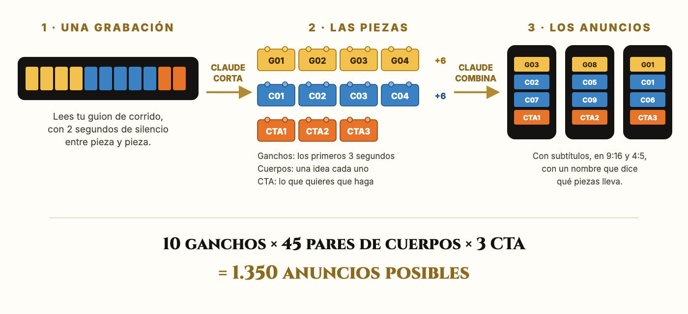

<p align="center"></p>

<h1 align="center">La Fábrica de Videos</h1>
<p align="center"><b>El sistema Lego: graba una vez, arma cientos de anuncios.</b><br>
Un recurso de <b>Imperio Agéntico</b> para el curso <i>Claude para Meta Ads</i>. Hecho con Claude Code.</p>

---

Escribes un guion en piezas que encajan entre sí, lo grabas en una sola sesión y Claude hace el resto en tu propio computador: encuentra cada pieza en la grabación, usa la última toma, la corta y arma las combinaciones con subtítulos, listas para Meta en 9:16 y 4:5.



## Qué necesitas

- Un computador (Mac o Windows).
- La app de Claude con un plan pagado (Pro o Max), para usar Claude Code.
- Unos 20 minutos la primera vez. Casi todo es responder preguntas sobre tu negocio.

## Cómo se instala: 3 pasos

1. **Descarga la app de Claude** desde [claude.com/download](https://claude.com/download), ábrela, inicia sesión y entra a la pestaña **Code**.
2. **Pega la caja de abajo** en un chat nuevo. El link de este repositorio ya va adentro: Claude descarga todo y prepara tu computador.
3. **Responde sus preguntas.** Te pregunta por tu negocio, escribe tu guion, te deja el teleprompter listo y, cuando le pases tu grabación, arma los anuncios.

> Si te pide permiso para instalar algo, toca **Permitir**. Todo queda dentro de la carpeta del kit.

### La caja para pegar

```text
Vas a instalar la "Fábrica de Videos" de Imperio Agéntico en este computador. NO soy
técnico: haz todo tú, nunca me pidas correr un comando ni editar un archivo a mano, y
explícame cada paso en español simple. Mantén una lista de tareas visible y ve marcando
lo que terminas.

1) DESCARGA EL KIT (en mi carpeta Documentos)
   git clone https://github.com/benjacord/imperio-fabrica-videos.git
   Si no hay git, baja este ZIP y descomprímelo ahí:
   https://github.com/benjacord/imperio-fabrica-videos/archive/main.zip
   Trabaja siempre dentro de esa carpeta y lee su CLAUDE.md antes de seguir.

2) PREPARA MI COMPUTADOR (gratis, solo lo que falte)
   python3 scripts/doctor.py --arreglar --modelo small
   Si no tengo Python, instálalo tú. Repite hasta que diga LISTO.

3) CONÓCEME (UNA pregunta a la vez)
   Mi negocio, qué vendo y a cuánto, a quién, qué problema resuelvo, mis pruebas
   reales y cómo hablo. Guárdalo en mi-negocio/perfil.md.

4) ESCRIBE MI GUION LEGO
   10 ganchos, 10 cuerpos y 3 llamados a la acción que encajen entre sí. Muéstramelo
   en una tabla, ajústalo conmigo y déjame el teleprompter listo.

5) CUANDO TE PASE MI GRABACIÓN
   Córtala (la última toma manda), arma 3 anuncios de prueba, muéstramelos y con mi OK
   arma el resto en 9:16 y 4:5.

Ten paciencia, asume que nunca he usado una terminal y usa solo este kit.
```

## Ya instalado: solo háblale

Abre Claude Code en la carpeta `imperio-fabrica-videos` y pide lo que quieras en español.

| Le dices | Qué pasa |
|---|---|
| "escríbeme un guion Lego nuevo" | 10 ganchos, 10 cuerpos y 3 CTA con tu perfil, listos para aprobar |
| "prepárame el teleprompter" | El guion en orden de lectura, con las pausas marcadas |
| "corta mi grabación" | Encuentra cada pieza, usa la última toma y te dice qué faltó |
| "arma 30 anuncios" | Las combinaciones en `30_ANUNCIOS`, en 9:16 y 4:5, con subtítulos |
| "escribe los textos para Meta" | Texto principal y titular por cada ángulo |

## Qué hay adentro

| Carpeta | Para qué |
|---|---|
| `CLAUDE.md` | El manual que lee Claude: el método, las reglas del guion y cada paso |
| `plantillas/guion.ejemplo.json` | El guion de ejemplo de Benja: 10 ganchos sacados de sus anuncios ganadores, con su costo por compra |
| `scripts/` | El motor: revisar el equipo, transcribir, cortar, combinar y armar |
| `10_GRABACIONES/` | Donde va tu grabación |
| `20_PIEZAS/` | Las piezas cortadas y el reporte |
| `30_ANUNCIOS/` | Tus anuncios terminados |
| `guia/` | La guía en PDF |

Todo corre en tu computador: la transcripción también (con faster-whisper), sin pagar nada extra. Lo que armas es tuyo.

---

<p align="center"><sub>Imperio Agéntico · skool.com/imperio · Curso Claude para Meta Ads de Benja (@bencord)</sub></p>
